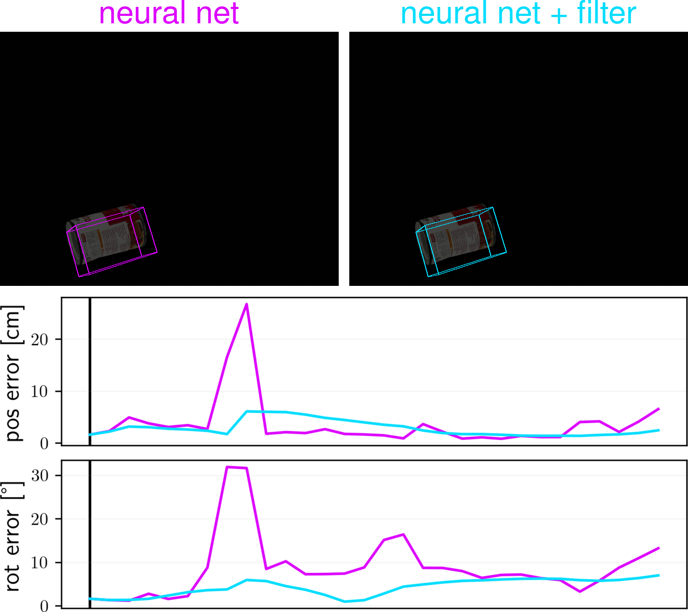

# Rigid Body Dynamics Estimation by Unscented Filtering Pose Estimation Neural Networks

---

This is the code for the paper

**Rigid Body Dynamics Estimation by Unscented Filtering Pose Estimation Neural Networks**

Trevor Avant & Kristi A. Morgansen, *American Control Conference (ACC) 2020*

## dependencies

* Python 3 (we used version 3.8)

* [Blender](https://www.blender.org) (we used version 2.8)

* the following non-standard python packages: numpy, scipy, transforms3d, pyrr, torch, torchvision, imageio, PIL, cv2, pyyaml

## before running the code

* add this repository to your `PYTHONPATH` (the `net_filter` directory is structured as a Python package)

* download the soup can checkpoint file (`soup_60.pth`) provided by the authors of DOPE from [this link](https://drive.google.com/drive/folders/1DfoA3m_Bm0fW8tOWXGVxi4ETlLEAgmcg) and put it in `net_filter/dope/` (note that this is file is linked to from the [DOPE Github page](https://github.com/NVlabs/Deep_Object_Pose))

## code

**1-d motions (Figure 3)**:

Run the command below (takes about 5 min on my computer):
* `python net_filter/sim/one_dim_gen.py`

**covariances (Figure 4)**:

Run the following sequence of commands twice: once with `mode = dim` and once with `mode = bright` uncommented at the top of each python file (each sequence generates 1,000 images, and takes about 30 min on my computer):
* `python net_filter/sim/cov_gen.py`
* `python net_filter/sim/cov_calc.py`

**simulation (Figure 5 \& Figure 6)**:

Run the command below (takes about 1 min on my computer):
* `python net_filter/sim/dynamic_run.py`
The plots will be saved in the `results/paper_figs/` directory. Also note that if you don't want to regenerate the images after initially running this script, set `regen = 0` for subsequent runs.

**monte carlo simulations (Table I)**: 

Run these commands (the first command will generate 100 trajectories, and takes over an hour on my computer):
* `python net_filter/sim/monte_carlo.py`
* `python net_filter/sim/monte_carlo_results.py`

## extra

**test the filter with synthetic measurements (i.e. the true measurements plus some random noise)**;
* `python net_filter/tests/filter_test.py`

**make the GIF**:

Run the following commands (note: the second command requires `imagemagick` and `ffmpeg` to be installed):
* `python net_filter/sim/video_comparison_boxes.py`
* `python net_filter/sim/video_comparison_two_vids_plot.py`

**apply DOPE to all images in a directory**:
* `python net_filter/tests/eval_test.py`

## notes
* In this project, we used the DOPE neural network. Code for DOPE is available on the [DOPE Github page](https://github.com/NVlabs/Deep_Object_Pose), but that code is designed to be used through a ROS interface. We needed to use DOPE purely through Python, so we based our code off of [this Github repository](https://github.com/Abdul-Mukit/dope_exp). This DOPE-related code in our project is found in the `net_filter/dope/` directory.

* In this project, we considered our object of interest to be the soup can from the YCB dataset. The Blender model we used is located at `blender_models/soup_can.blend`. This model was created by downloading a laser scan model from [this page](http://ycb-benchmarks.s3-website-us-east-1.amazonaws.com/), opening it in Blender, and converting it to Blender's `.blend` format.

* By default, this code will use CUDA for both the generation of images using Blender, and the evaluation of the images using DOPE. If CUDA is not available or you don't want to use it, you should be able to use your CPU by changing `use_cpu` to `True` in `net_filter/dope/detector.py`. This should make both Blender and DOPE use the CPU.

